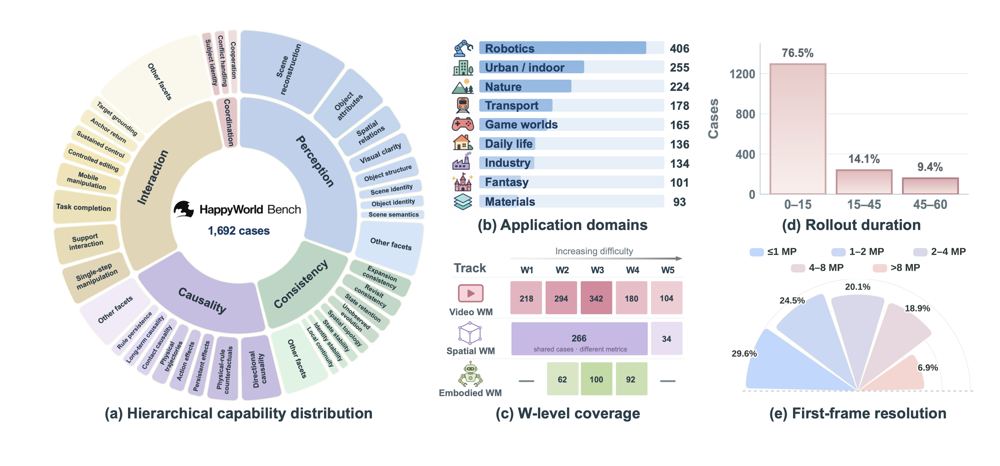
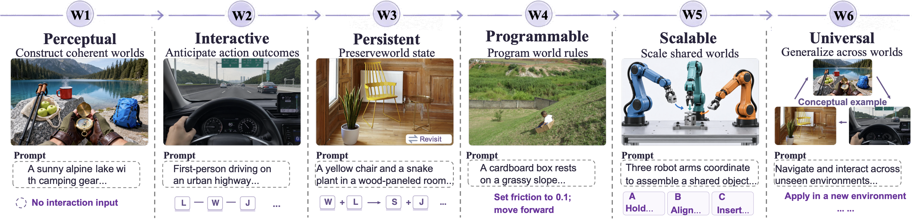

  

**Evaluating the reliability of video, spatial, and embodied world models.**

[Arena](https://skyeval.com/sla/arena/happyworld) · [Technical Report](./HappyWorldBench_technical_report.pdf) · [Repository](https://github.com/LivingFutureLab/HappyWorldBench) · [Feedback](https://github.com/LivingFutureLab/HappyWorldBench/issues)

## Overview

HappyWorld-Bench is a comprehensive benchmark built around a central question: **Do generated worlds remain reliable as agents explore, interact with, and modify them?**

We introduce a hierarchy of six world capabilities, from perceptual world construction to universal world modeling, and instantiate this framework across three evaluation tracks: **video world models, spatial world models, and embodied world models**. Human pairwise comparisons and automated metrics provide complementary assessments of visual quality, state consistency, causal behavior, and interaction reliability.

<em>Benchmark composition and evaluation coverage across 1,692 cases.</em>

## Motivation

World-model evaluation remains fragmented across video, spatial world modeling, and embodied world modeling. Visual fidelity alone does not establish that a world preserves object identity, responds correctly to actions, or maintains the consequences of past interactions.

HappyWorld-Bench provides a shared capability framework while retaining track-specific inputs, outputs, and evaluation protocols. This design helps researchers identify strengths and failure modes in interaction, persistence, causal response, and intervention.

## Six-Level Capability Framework

<em>Illustrative examples of W1–W6 world capabilities.</em>

| Level | World Capability | Definition |
| --- | --- | --- |
| **W1** | **Perceptual World** | Construct a coherent world representation from visual or multimodal conditions, with correct semantics, spatial structure, and short-term temporal continuity. |
| **W2** | **Interactive World** | Simulate action-conditioned state transitions, predicting how agents, objects, and environments evolve in response to interaction while preserving local geometric, physical, and causal consistency. |
| **W3** | **Persistent World** | Maintain global spatial structure, object identity, and accumulated world states over long-horizon interaction, viewpoint changes, occlusion, and revisitation. |
| **W4** | **Programmable World** | Support explicit interventions on objects, events, behaviors, or world rules, with intended changes propagated causally while unaffected content remains consistent. |
| **W5** | **Scalable World** | Generate infinitely extensible world states shared by multiple embodied or virtual agents, supporting agent communication, synchronization, cooperation, and conflict handling under partial observability. |
| **W6** | **Universal World** | Integrate generation, simulation, persistent state modeling, interaction, and planning into a unified system that fully replicates the real world and generalizes across environments, tasks, modalities, and embodiments. |

## Three Evaluation Tracks

| Track | Evaluation Focus |
| --- | --- |
| **Video World Models** | Perception and representation, consistency and state retention, causality and causal rollout, and controllable interaction and counterfactuals in generated videos. |
| **Spatial World Models** | Observable quality, physical usability, scene- and object-level consistency, controlled editing, and spatial expansion with preservation. |
| **Embodied World Models** | Action-conditioned visual predictions from an egocentric robot viewpoint, including atomic actions, persistent state across multi-step sequences, and paired interventions under changed action conditions or physical rules. |

## Application Domains

The benchmark spans nine application domains:

- Robotics
- Urban and indoor environments
- Nature
- Transport
- Game worlds
- Daily life
- Industry
- Fantasy
- Materials

## Arena and Automated Evaluation

Visit [HappyWorld-Arena](https://skyeval.com/sla/arena/happyworld) to compare world model outputs and participate in pairwise evaluation.

Our evaluation combines two complementary approaches:

- **Human Arena evaluation:** Blind pairwise comparisons and Elo ratings capture overall human preferences within each track.
- **Automated benchmarking:** Capability-specific metrics assess perception, consistency, causality, controllability, physical usability, editing, persistence, and expansion where applicable.

Overall preference and capability scores are reported separately, helping distinguish visual appeal from interaction reliability and identify specific capability gaps. See the technical report for evaluation protocols, metric definitions, and experimental results.

We welcome researchers, developers, and industry partners to participate in model evaluation, Arena comparisons, and discussions on evaluation methodology.

## Technical Report

[Read the technical report (PDF)](./HappyWorldBench_technical_report.pdf)

Updated versions of the report will be published in this repository through the same link.

**Project entry point:** https://github.com/LivingFutureLab/HappyWorldBench

## Feedback and Collaboration

Please use [GitHub Issues](https://github.com/LivingFutureLab/HappyWorldBench/issues) to report problems, suggest evaluation improvements, or discuss collaboration.
